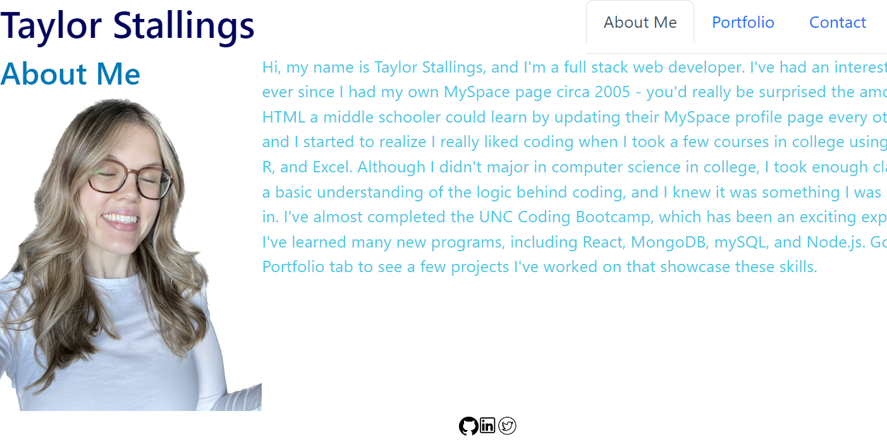

# React Portfolio

This portfolio uses React to showcase projects I have worked on, along with my proficiencies and resume. Use this site to see examples of my work and what I've learned while in the UNC Coding Bootcamp.

## Features

- React
- Bootstrap

## Installation

Install dependencies with npm

```cmd-line
  npm install
```

Requires `react`,
Requires `bootstrap`

## Demo



## Deployment

To see deployed site, click here:
https://mtstall.github.io/react-portfolio/

## Authors (alphabetical)

Taylor Stallings

## License

Please refer to license in Repo.
